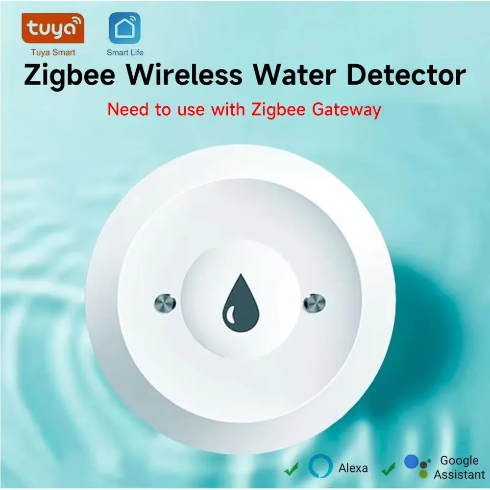

# <a id="Top">Tuya Water Leak Sensor Zigbee with custom firmware</a>

### Custom firmware for Tuya sensor models

**Не все датчики можно обновить через ОТА**.

**Автор не несет никакой отвественности, если вы, воспользовавшись этим проектом, превратите свой умный датчик в полоумный.**

> [!WARNING]
> Внимание!!! Перед обновлением разбираем датчик и проверяем, что он изговотовлен именно на модуле ZTU или на чипе, как на фото ниже. Если у вас датчик не похож на те, что изображены на фото, лучше не заливать, большая вероятность получить кирпич. 

- _TZ3000_k4ej3ww2
- _TZ3000_kstbkt6a
- _TZ3000_upgcbody




Проверялся только в zigbee2mqtt.

## Зачем. 

Практически все заводские `Zigbee` датчики протечки не умеют посылать команды напрямую исполнительному устройству, например мотору крана. И если сеть рухнула, например отключили электричество, то система антипротечки не сработает, даже если она построена на батарейных устройствах. Прямой биндинг решает эту проблему.

## Что получилось. 

**About**


**Exposes**


**Reporting**


## Как обновить.

Сначала подключаем к z2m один внешний [конвертор](https://github.com/slacky1965/ts0207_tz3000_zed/tree/main/zigbee2mqtt) `zg_222za_orig.js`. Он активирует OTA в z2m для датчика с прошивкой от Tuya.

Далее нужно добавить локальное хранилище обновлений. 

Создаем директорию `images` в директории z2m и кладем туда файл [1141-d3a3-1111114b-ts0207_tz3000_zrd.zigbee](https://github.com/slacky1965/ts0207_tz3000_zed/raw/refs/heads/main/bin/1141-d3a3-1111114b-ts0207_tz3000_zrd.zigbee).

Копируем в директорию z2m файл [local_ota_index.json](https://github.com/slacky1965/ts0207_tz3000_zed/blob/main/zigbee2mqtt/local_ota_index.json)

В конфиг z2m `configuration.yaml` добавляем локальное хранилище

```
ota:
  zigbee_ota_override_index_location: local_ota_index.json
```

А конвертор `zg_222za_orig.js` кладем в директорию `external_converters`, которую нужно создать в корне z2m.

Далее перегружаем z2m. И видим у нас новое устройство.


Далее идем в раздел OTA. И видим там свое устройство. Будим датчик, нажимая на его кнопку и только потом жмем проверить обновления.


	
Жмем на появившуюся красную кнопку. И обновляемся.


	
Если все не так, как описано, значит вы что-то сделали не по инструкции (не положили файл куда нужно, не перегрузили z2m) или сигнатуры вашего датчика нет в списке поддерживаемых устройств.

> [!WARNING]
> Внимание!!! Если в процессе вы обнаружите на каких-то устройствах Туя, которые возможно у вас есть еще в системе, новое обновление, то обновлять ничего не нужно!!! Иначе вы зальете в это устройство прошивку от датчика и получите кирпич!!! Если же процесс обновления по ошибке уже начался, то просто обесточьте это устройство!!!

Далее ждем окончания.

После обновления нужно удалить устройство из z2m. Перегрузить z2m. Разрешить сопряжение. Зажать кнопку на 5 секунд, пока светодиод не начнет моргать и отпустить. Начнется сопряжение.


Все, датчик готов к работе.

> [!WARNING]
> Внимание!!! Залитая первый раз прошивка является промежуточной. В ней есть код для проверки `bootloader'а`, который несет потенциальную угрозу порчи этого `bootloader'a` в будущем. Поэтому нужно обновиться еще раз уже на окончательную версию, где этот код не используется. Сразу сделать без этой проверки нельзя (привет Tuya). Для понимания - промежуточная версия имеет номер 1.0.00. Процесс обновления ОТА достаточно энергозатратный, поэтому или нужно запастись батарейками, или подключить датчик к внешнему 3-х вольтовому источнику питания.

## Логика работы устройства.

Устройство практически всегда находится в режиме глубокого сна. При кратковременном нажатии на кнопку, обнаружении протечки, обнаружении окончания протечки, а также ввод нового устройства в сеть, оно работает в штатном режиме 20 секунд. Затем оно уходит в глубокий сон на 1 час. Через час оно просыпается, поллит координатор и через 20 секунд опять засыпает на 1 час. И так по кругу. Если нужно передать какие-то настройки на устройство, его нужно сперва разбудить коротким одиночным нажатием на кнопку.

При обнаружении протечки устройство сигнализирует об этом через кластер `IAS` и, если был заранее настроен прямой биндинг на исполнительные устройства, шлет команду `OnOff` на эти устройства.

## Параметры устройства.

- **Battery** - емкость батарейки в %.
- **Voltage** - напряжение батарейки в mV.
- **Water leak** - оповещение о протечке. `Clear` нет протечки, `Leaking` протечка обнаружена.
- **Battery low** - оповещение о севшей батарейке. `False` - батарея в порядке, `True` - требует замены.
- **Switch actions** - настраивает, какую именно команду мы шлем при управлении удаленным устройством. Если этот параметр установлен в `On`, то при обнаружении протечки на удаленное устройство посылается команда `On`, а при окончании протечки ничего не посылается. Если этот параметр установлен в `Off` (так сделано по умолчанию), то при обнаружении протечки на удаленное устройство посылается команда `Off`, а при окончании протечки ничего не посылается. Если этот параметр выставлен в `Toggle`, то при обнаружении протечки на удаленное устройство посылается команда `Toggle`, а при окончании протечки ничего не посылается.
- **Action** - информирует, какую последнюю команду отправили на исполнительное устройств.

## Немного про настройку прямого биндинга для управления каким-либо устройством.

Для управление внешним устройством напрямую нужно сперва настроить биндинг. Это делается во вкладке `Bind` z2m. Выбираем Эндпоинт 1, затем выбираем устройство, которым хотим управлять, отмечаем кластер `OnOff`. Затем нажимаем кнопку на самом датчике, чтобы его разбудить и после жмем `Bind` в интерфейсе z2m. Система оповестит об успешном соединении или об ошибке.


Если нужно закрыть не один кран, а несколько, то создаем еще одну прямую привязку к другому устройству. И т.д.


## Потребление

В режиме ожидания протечки (измерялось - протечки нет на протяжении 10 часов) батарейки должно хватить минимум на 10 лет.


---

Связаться со мной можно в **[Telegram](https://t.me/slacky1965)**.

### Если захотите отблагодарить автора, то это можно сделать через [ЮMoney](https://yoomoney.ru/to/4100118300223495)

## P.S. 

Датчик покупался [вот тут](https://aliexpress.ru/item/1005007627377380.html?sku_id=12000041560940091). 

Второй датчик покупался [вот тут](https://aliexpress.ru/item/1005007399103547.html?sku_id=12000040584803584) (за это отдельное спасибо [Олегу](https://t.me/Novgorod_DIYZi)). 

## История версий
- 1.0.01
	- Тестовая версия. Команда OnOff отправляется не только при обнаружении протечки, но и при устранении протечки. Сделано для более легкого тестирования.
- 1.0.02
	- Устранена проблема засыпания при ОТА.

[Наверх](#Top)


