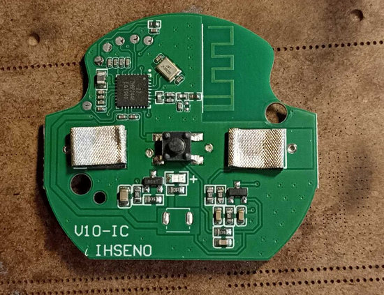
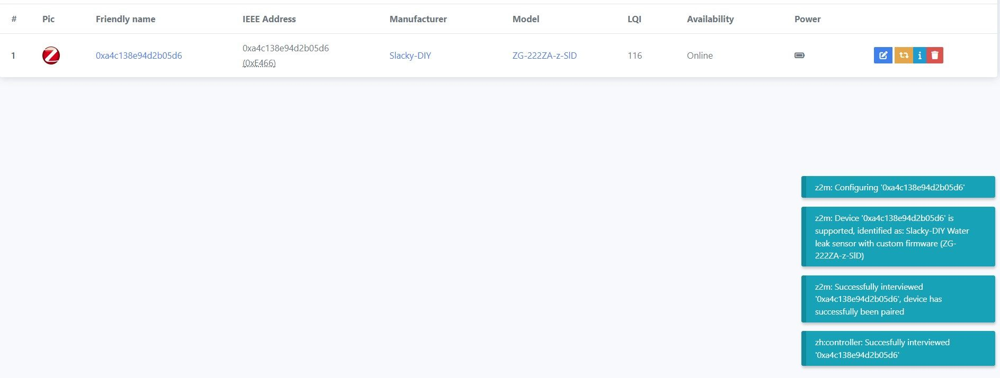

### Custom firmware for Tuya sensor models

- _TZ3000_k4ej3ww2
- _TZ3000_kstbkt6a

> [!WARNING]
> **Внимание!!! Для каждого типа датчика применяется своя отдельная прошивка. Поэтому будьте внимательны к выбору файлов. Иначе потом придется использовать программатор для восстановления работоспособности.**

В этих датчиках применен или модуль ZTU или чип TLSR8258F1KET32. Прошивку можно залить через ОТА.




В `zigbee2mqtt` он определяется по разному, в зависимости от оригинальной прошивки, но по сути это одно и тоже устройство.


## Как обновить.

Сначала подключаем к `zigbee2mqtt` один внешний [конвертор](zigbee2mqtt) `tuya_waterleak_tz3000_orig.js`. Он активирует OTA в `zigbee2mqtt` для датчика с прошивкой от Tuya.

Далее нужно добавить локальное хранилище обновлений. 

Создаем директорию `images` в директории `zigbee2mqtt` и кладем туда файл [1141-d3a3-1111114b-zg_222za-1M.zigbee](bin/1141-d3a3-1111114b-zg_222za-1M.zigbee).

Копируем в директорию `zigbee2mqtt` файл [local_ota_index.json](zigbee2mqtt/local_ota_index.json)

В конфиг `zigbee2mqtt` `configuration.yaml` добавляем локальное хранилище

```
ota:
  zigbee_ota_override_index_location: local_ota_index.json
```

А конвертор `tuya_waterleak_tz3000_orig.js` кладем в директорию `external_converters`, которую нужно создать в корне `zigbee2mqtt`.

Далее перегружаем `zigbee2mqtt`. И видим у нас новое устройство.


Далее идем в раздел OTA. И видим там свое устройство. Будим датчик, нажимая на его кнопку и только потом жмем проверить обновления.


	
Жмем на появившуюся красную кнопку. И обновляемся.


	
Если все не так, как описано, значит вы что-то сделали не по инструкции (не положили файл куда нужно, не перегрузили `zigbee2mqtt`) или сигнатуры вашего датчика нет в списке поддерживаемых устройств.

> [!WARNING]
> Внимание!!! Если в процессе вы обнаружите на каких-то устройствах Туя, которые возможно у вас есть еще в системе, новое обновление, то обновлять ничего не нужно!!! Иначе вы зальете в это устройство прошивку от датчика и получите кирпич!!! Если же процесс обновления по ошибке уже начался, то просто обесточьте это устройство!!!

Далее ждем окончания.

После обновления нужно удалить устройство из `zigbee2mqtt`. Перегрузить `zigbee2mqtt`. Разрешить сопряжение. Зажать кнопку на 5 секунд, пока светодиод не начнет моргать и отпустить. Начнется сопряжение.



Все, датчик готов к работе.


> [!WARNING]
> Внимание!!! Залитая первый раз прошивка является промежуточной. В ней есть код для проверки `bootloader'а`, который несет потенциальную угрозу порчи этого `bootloader'a` в будущем. Поэтому нужно обновиться еще раз уже на окончательную версию, где этот код не используется. Сразу сделать без этой проверки нельзя (привет Tuya). Для понимания - промежуточная версия имеет номер 1.0.00. Процесс обновления ОТА достаточно энергозатратный, поэтому или нужно запастись батарейками, или подключить датчик к внешнему 3-х вольтовому источнику питания.

## P.S. 

Датчик покупался [вот тут](https://aliexpress.ru/item/1005007627377380.html?sku_id=12000041560940091). 

Второй датчик покупался [вот тут](https://aliexpress.ru/item/1005007399103547.html?sku_id=12000040584803584) (за это отдельное спасибо [Олегу](https://t.me/Novgorod_DIYZi)). 


