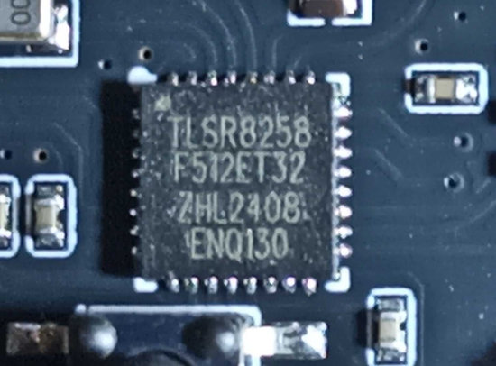

### Custom firmware for Tuya sensor models

- _TZ3000_k4ej3ww2

> [!WARNING]
> **Внимание!!! Для каждого типа датчика применяется своя отдельная прошивка. Поэтому будьте внимательны к выбору файлов. Иначе потом придется использовать программатор для восстановления работоспособности.**

В этом датчике применен чип `TLSR8258F512ET32`. **!!!Прошивку нельзя залить через ОТА!!!**

Прошивку нельзя обновить через ОТА, производитель не предусмотрел такого рода обновление - нет кластера ОТА.

В `zigbee2mqtt` он определяется вот так.

Чтобы обновить прошивку для этого датчика нужно воспользовать программатором. Как сделать недорогой программатор описано [вот тут](https://github.com/pvvx/TLSRPGM)

Нужно подключить всего 3 проводника - +3V3, GND и SWS.

Файл для прошивки нужен вот такой - [zg_227z_0x18_zed_V1.0.05.bin](bin/zg_227z_0x18_zed_V1.0.05.bin)

Прежде, чем заливать прошивку, модуль лучше очистить полностью от предыдущей информации, хранящейся на флеш-памяти.

После прошивки датчик в `zigbee2mqtt` будет выглядеть так.

Еще можно воспользоваться `usb-uart` адаптером. Как залить прошивку можно почитать [тут](https://github.com/pvvx/ATC_MiThermometer?tab=readme-ov-file#the-usb-com-adapter-writes-the-firmware-in-explorer-web-version). Зайдите на страницу [USBCOMFlashTx.html](https://pvvx.github.io/ATC_MiThermometer/USBCOMFlashTx.html). Назначьте порт - `Open`. Нажмите на кнопку на датчике, светодиод должен моргнуть. Далее нажмите `Erase All Flash`. Когда в логе отразится, что очистка завершена, снова нажмите на кнопку. Светодитод не должен моргать. Если он моргнет, значит вы ничего не стерли - проверьте подключение. Если не моргает, значит все хорошо. Выберите файл [zg_227z_0x18_zed_V1.0.05.bin](bin/zg_227z_0x18_zed_V1.0.05.bin) (версия может быть уже другой!). И нажмите `Write to Flash`. 

 ## P.S.
 
 Приобретался датчик на [Озоне](https://www.ozon.ru/product/datchik-protechki-tuya-zigbee-3-0-1592445428/)

