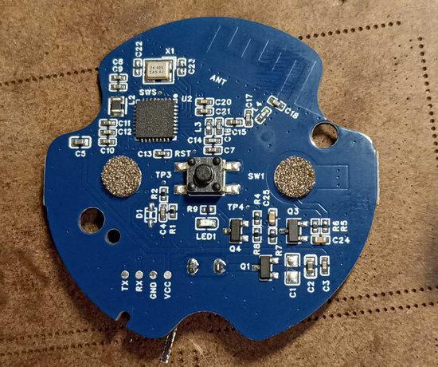
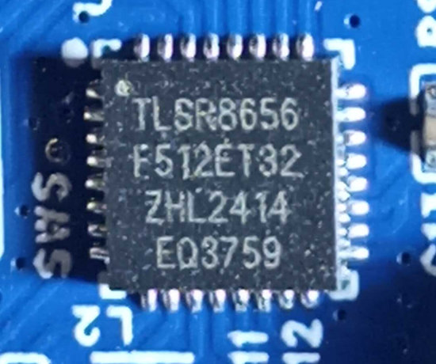
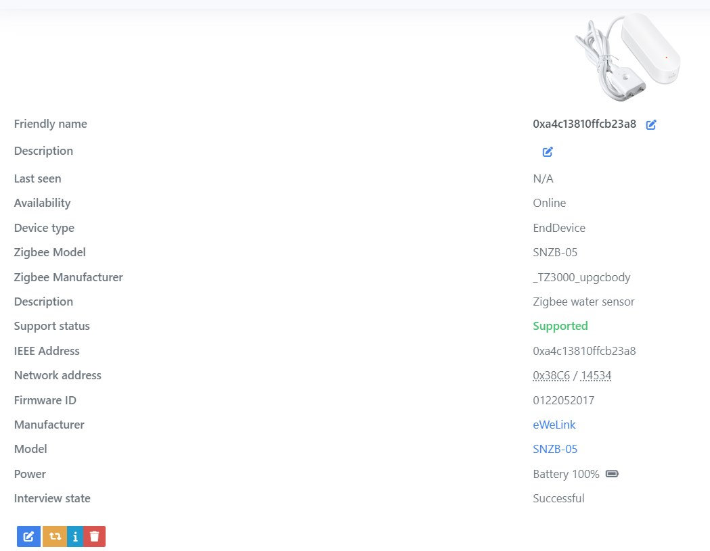
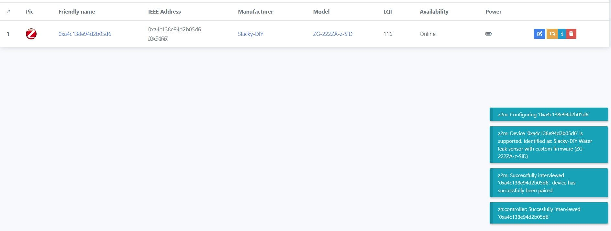
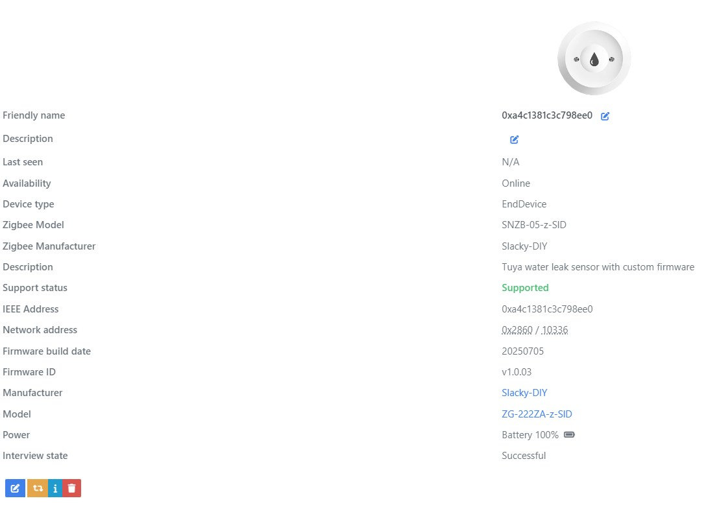

### Custom firmware for Tuya sensor models

_TZ3000_upgcbody

> [!WARNING]
> **Внимание!!! Для каждого типа датчика применяется своя отдельная прошивка. Поэтому будьте внимательны к выбору файлов. Иначе потом придется использовать программатор для восстановления работоспособности.**

В этом датчике применен чип `TLSR8656F512ET32`. Прошивку можно залить через ОТА.





В `zigbee2mqtt` он определяется вот так.



## Как обновить.

Сначала подключаем к `zigbee2mqtt` один внешний [конвертор](zigbee2mqtt) `tuya_waterleak_tz3000_orig.js`. Он активирует OTA в `zigbee2mqtt` для датчика с прошивкой от Tuya.

Далее нужно добавить локальное хранилище обновлений. 

Создаем директорию `images` в директории `zigbee2mqtt` и кладем туда файл [1286-0202-1111114b-snzb_05-512K.zigbee](bin/1286-0202-1111114b-snzb_05-512K.zigbee).

Копируем в директорию `zigbee2mqtt` файл [local_ota_index.json](zigbee2mqtt/local_ota_index.json)

В конфиг `zigbee2mqtt` `configuration.yaml` добавляем локальное хранилище

```
ota:
  zigbee_ota_override_index_location: local_ota_index.json
```

А конвертор `tuya_waterleak_tz3000_orig.js` кладем в директорию `external_converters`, которую нужно создать в корне `zigbee2mqtt`.

Далее перегружаем `zigbee2mqtt`. И видим у нас новое устройство.


Далее идем в раздел OTA. И видим там свое устройство. Будим датчик, нажимая на его кнопку и только потом жмем проверить обновления.


	
Жмем на появившуюся красную кнопку. И обновляемся.


	
Если все не так, как описано, значит вы что-то сделали не по инструкции (не положили файл куда нужно, не перегрузили `zigbee2mqtt`) или сигнатуры вашего датчика нет в списке поддерживаемых устройств.

> [!WARNING]
> Внимание!!! Если в процессе вы обнаружите на каких-то устройствах Туя, которые возможно у вас есть еще в системе, новое обновление, то обновлять ничего не нужно!!! Иначе вы зальете в это устройство прошивку от датчика и получите кирпич!!! Если же процесс обновления по ошибке уже начался, то просто обесточьте это устройство!!!

Далее ждем окончания.

После обновления нужно удалить устройство из `zigbee2mqtt`. Перегрузить `zigbee2mqtt`. Разрешить сопряжение. Зажать кнопку на 5 секунд, пока светодиод не начнет моргать и отпустить. Начнется сопряжение.



Все, датчик готов к работе.



P.S. Приобретался датчик на [WB](https://www.wildberries.ru/catalog/265993742/detail.aspx?targetUrl=EX)

